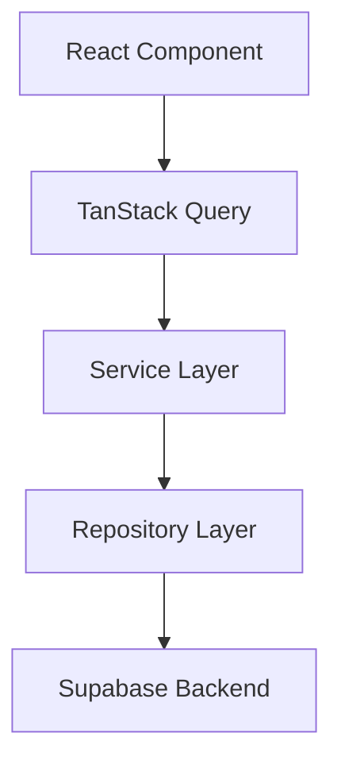

<div align="center">

  <h1>🧭 Kariyer Pusulası</h1>
  <h3><i>Personal Applicant Tracking System (ATS) for Ambitious Job Seekers</i></h3>

  <p>
    <b>Take complete command of your job search with an intuitive, data-driven SaaS workspace.</b>
  </p>

  <p>
    <a href="#"></a>
    <a href="#"></a>
    <a href="#"></a>
    <a href="#"></a>
    <a href="#"></a>
  </p>

</div>

---

### 📌 Purpose

**Kariyer Pusulası** is a modern, candidate-centric Applicant Tracking System (ATS) built for job seekers. It replaces messy spreadsheets and lost emails with a structured SaaS workspace to track applications, interview timelines, and offer metrics. Inspired by tools like Linear and Notion, it brings clarity and speed to your career journey.

---

### ✨ Key Features

- 🎯 **End-to-End Application Pipeline** — Track job applications seamlessly across structured lifecycle stages (Applied, Screening, Interviewing, Offer, Rejected).
- ⚡ **Real-Time Search & Smart Filters** — Instantly locate and filter applications by company, position, priority, or remote status with debounced live search.
- 🔐 **Enterprise-Grade Security** — Powered by Supabase Row Level Security (RLS) to ensure absolute data isolation and privacy for every job seeker.
- 🎨 **Modern Minimalist UI/UX** — Ultra-responsive dark mode aesthetics built with glassmorphism, clean typography, and fluid micro-interactions.
- 🚀 **Optimistic Data Operations** — High-speed interactivity driven by TanStack Query for zero-latency state updates and robust caching.

---

### 🛠️ Tech Stack

<p align="center">
  
  
  
  
  
  
  
</p>

---

## 🚀 Features

### 💻 Core Workflow

- ✅ **Authentication & Security** — Email and password authentication, protected routes, and session persistence via Supabase Auth.
- ✅ **Application Management** — Full lifecycle tracking (Applied, Interviewing, Offer, Rejected) with salary, notes, and detail views.
- ✅ **Bulk Operations** — Batch updates, stage transitions, and bulk record deletion for candidate workflows.

### 🔍 Search & UI Experience

- ✅ **Real-Time Search & Filters** — Debounced instant search by company or position, paired with multi-column sorting.
- ✅ **Responsive Table & Mobile Cards** — High-density desktop table layout auto-adapting to touch cards on mobile devices.
- ✅ **Modern Dark Theme & UX States** — Glassmorphic UI, skeleton loading states, empty states, and toast notifications.

### ⚡ Architecture & Performance

- ✅ **TanStack Query State** — Smart caching, optimistic UI updates, and zero-latency client state synchronization.
- ✅ **Supabase RLS & Zod Validation** — Database row-level security for total data isolation combined with strict schema validation.

---

## 📸 Screenshots

### Dashboard

*High-level overview displaying application status counts, upcoming interview schedules, conversion metrics, and recent activity logs.*

### Applications

*Central application management interface featuring live search, custom filters, status tags, and bulk management capabilities.*

### Application Detail

*In-depth view of a specific application including interview stages, custom notes, contact persons, and offer tracking.*

### Authentication

*Secure login and registration interface featuring form validation, error handling, and password recovery workflows.*

### Mobile

*Responsive touch-optimized view showcasing card layouts, mobile navigation drawer, and quick-action toolbars.*

---

## 🏗️ Architecture

### High-Level Architecture


### Data Flow Architecture



### Core Architectural Principles

- **Separation of Concerns**: Each architectural layer maintains a single responsibility. UI components handle rendering and user interactions, services govern business logic and data validation, while repositories isolate direct database operations.
- **Feature-Based Architecture**: Code is structured around domain modules (Applications, Authentication, Companies), keeping components, hooks, and utilities co-located for high maintainability.
- **Repository Pattern**: Decouples business services from direct database SDK calls, enabling consistent data querying, simplified mock testing, and seamless backend refactoring.
- **TanStack Query Responsibilities**: Orchestrates asynchronous server state, handles optimistic UI updates, manages background re-validation, and caches data to reduce unnecessary network traffic.
- **Supabase Responsibilities**: Manages secure user authentication, real-time database subscriptions, PostgreSQL data storage, and Row Level Security (RLS) enforcement per user.

---

## 📂 Project Structure

```text
src/
├── components/          # Reusable UI components
├── features/
│   ├── applications/    # Application management module
│   ├── auth/            # Authentication module
│   └── dashboard/       # Dashboard (planned)
├── hooks/               # Shared custom hooks
├── lib/                 # Utilities and configurations
├── repositories/        # Data access layer
├── services/            # Business logic
├── types/               # TypeScript definitions
└── utils/               # Shared helper functions
```

---

## 💡 Why Kariyer Pusulası?

Most Applicant Tracking Systems (ATS) are built for recruiters and hiring teams. **Kariyer Pusulası** takes a different approach—it is designed entirely for job seekers.

Managing dozens of applications across multiple platforms can quickly become overwhelming. Spreadsheets become outdated, emails get buried, and important interview dates are easily missed.

Kariyer Pusulası provides a modern, centralized workspace where candidates can organize applications, monitor interview progress, analyze job search performance, and make more informed career decisions.

The long-term vision is to evolve beyond application tracking into an intelligent career companion powered by analytics and AI-driven insights.

---

## 🗺️ Product Roadmap

### ✅ Phase 1 — Foundation
- [x] Project setup
- [x] Authentication
- [x] Database architecture
- [x] User profiles

### ✅ Phase 2 — Applications
- [x] Application CRUD
- [x] Advanced Search
- [x] Filters & Sorting
- [x] Bulk Actions
- [x] Production Hardening

### 🚧 Phase 3 — Dashboard & Analytics
- [ ] KPI Dashboard
- [ ] Application Funnel
- [ ] Activity Timeline
- [ ] Weekly & Monthly Statistics
- [ ] Charts & Data Visualization

### 🔜 Phase 4 — Productivity
- [ ] Company Management
- [ ] Interview Tracker
- [ ] Notes & Documents
- [ ] Goal Tracking

### 🤖 Phase 5 — AI Features
- [ ] Resume Analyzer
- [ ] Cover Letter Assistant
- [ ] Interview Preparation
- [ ] Personalized Career Insights
