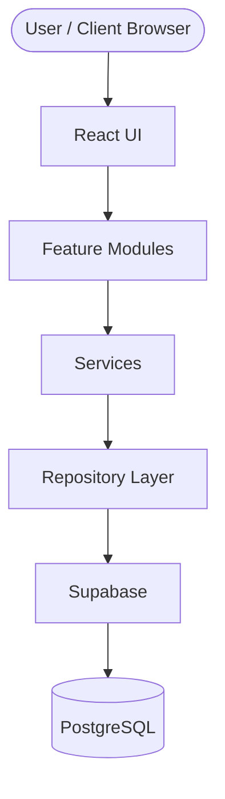
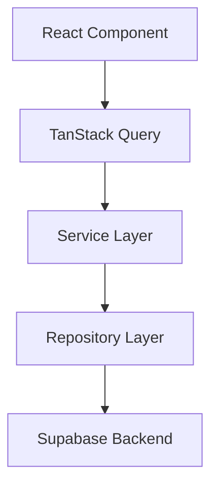

  <h1>🧭 Kariyer Pusulası</h1>
  <h3><i>Personal Applicant Tracking System (ATS) for Ambitious Job Seekers</i></h3>

  

    <b>Take complete command of your job search with an intuitive, data-driven SaaS workspace.</b>
  

  

    
    
    
    
  

---

### 📌 Purpose

**Kariyer Pusulası** is a modern, candidate-centric Applicant Tracking System (ATS) engineered specifically for job seekers, not recruiters. Traditional job hunting relies on scattered spreadsheets and lost email threads; Kariyer Pusulası centralizes application tracking, interview timelines, company research, and analytics into a cohesive, high-performance SaaS workspace inspired by top-tier tools like Linear and Notion.

---

### ✨ Key Features

- 🎯 **End-to-End Application Pipeline** — Track job applications seamlessly across structured lifecycle stages (Applied, Screening, Interviewing, Offer, Rejected).
- ⚡ **Real-Time Search & Smart Filters** — Instantly locate and filter applications by company, position, priority, or remote status with debounced live search.
- 🔐 **Enterprise-Grade Security** — Powered by Supabase Row Level Security (RLS) to ensure absolute data isolation and privacy for every job seeker.
- 🎨 **Modern Minimalist UI/UX** — Ultra-responsive dark mode aesthetics built with glassmorphism, clean typography, and fluid micro-interactions.
- 🚀 **Optimistic Data Operations** — High-speed interactivity driven by TanStack Query for zero-latency state updates and robust caching.

---

### 🛠️ Tech Stack

  
  
  
  
  
  
  

---

## 🚀 Features

### 🔐 Authentication

- ✅ **Secure Login & Registration** — Email and password authentication powered by Supabase Auth with encrypted tokens.
- ✅ **Password Reset Flow** — Self-serve password recovery via automated verification emails.
- ✅ **Protected Route Architecture** — Client-side route guards preventing unauthorized navigation to dashboard routes.
- ✅ **Session Persistence** — Long-lived, secure session management maintaining state across browser refreshes.

### 📋 Application Management

- ✅ **Create & Edit Applications** — Modal-driven entry forms for tracking salary, pipeline stage, notes, and job links.
- ✅ **Delete & Archive Records** — Safe application deletion with immediate workspace state synchronization.
- ✅ **Detailed Application View** — Comprehensive breakdown of interview stages, notes, and activity timeline per job.
- ✅ **Bulk Operations** — Select and update or remove multiple application records simultaneously.

### 🔍 Search & Organization

- ✅ **Real-Time Search** — Debounced live search querying company names, job titles, and locations instantly.
- ✅ **Advanced Filters** — Filter applications by pipeline stage, priority level, or remote work preference.
- ✅ **Multi-Column Sorting** — Dynamic sorting by application date, salary range, or status.
- ✅ **Responsive Table & Mobile Cards** — Data-dense table layout for desktop, auto-adapting to touch-friendly cards on mobile.

### 📊 User Experience

- ✅ **Modern Dark Theme** — Sleek dark UI designed for reduced eye strain during extended job hunting sessions.
- ✅ **Glassmorphism UI** — Translucent panels, smooth hover effects, and crisp, modern typography.
- ✅ **Comprehensive UI States** — Skeleton loaders, informative empty states, and structured error banners.
- ✅ **Toast Notification System** — Real-time feedback for async operations, errors, and success triggers.

### ⚡ Performance

- ✅ **TanStack Query Caching** — Background data fetching, automatic revalidation, and intelligent garbage collection.
- ✅ **Optimistic UI Updates** — Instant UI mutations before server response with automatic rollback on error.
- ✅ **Debounced Search Inputs** — Reduced API requests and minimal network overhead during rapid typing.
- ✅ **Memoized List Filtering** — High-performance client-side sorting and filtering without re-render lag.

### 🛡️ Security

- ✅ **Supabase Auth & RLS** — Database-level Row Level Security ensuring candidates access only their own records.
- ✅ **Zod Schema Validation** — Runtime type checking and input sanitization for all forms and request payloads.
- ✅ **End-to-End Type Safety** — Full TypeScript integration from PostgreSQL database schemas to React components.

---

## 📸 Screenshots

### Dashboard

*High-level overview displaying application status counts, upcoming interview schedules, conversion metrics, and recent activity logs.*

### Applications

*Central application management interface featuring live search, custom filters, status tags, and bulk management capabilities.*

### Create Application

*Streamlined modal dialog for adding new job applications with salary inputs, company details, tags, and job posting URLs.*

### Application Detail

*In-depth view of a specific application including interview stages, custom notes, contact persons, and offer tracking.*

### Authentication

*Secure login and registration interface featuring form validation, error handling, and password recovery workflows.*

### Mobile Experience

*Responsive touch-optimized view showcasing card layouts, mobile navigation drawer, and quick-action toolbars.*

---

## 🏗️ Architecture

### High-Level Architecture

### Data Flow Architecture

### Core Architectural Principles

- **Separation of Concerns**: Each architectural layer maintains a single responsibility. UI components handle rendering and user interactions, services govern business logic and data validation, while repositories isolate direct database operations.
- **Feature-Based Architecture**: Code is structured around domain modules (Applications, Authentication, Companies), keeping components, hooks, and utilities co-located for high maintainability.
- **Repository Pattern**: Decouples business services from direct database SDK calls, enabling consistent data querying, simplified mock testing, and seamless backend refactoring.
- **TanStack Query Responsibilities**: Orchestrates asynchronous server state, handles optimistic UI updates, manages background re-validation, and caches data to reduce unnecessary network traffic.
- **Supabase Responsibilities**: Manages secure user authentication, real-time database subscriptions, PostgreSQL data storage, and Row Level Security (RLS) enforcement per user.
