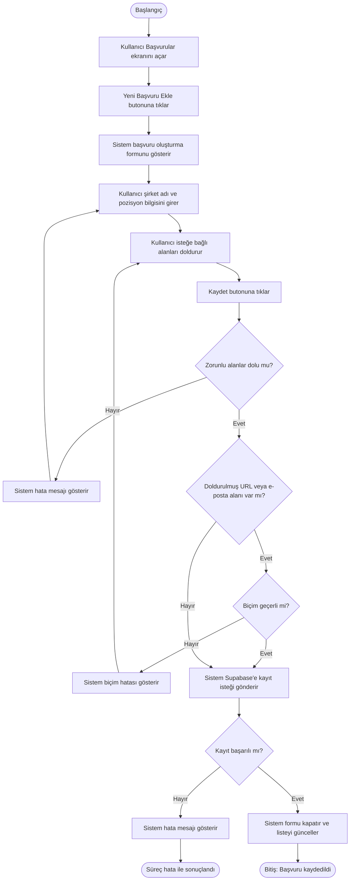
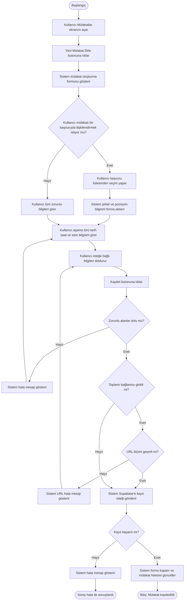
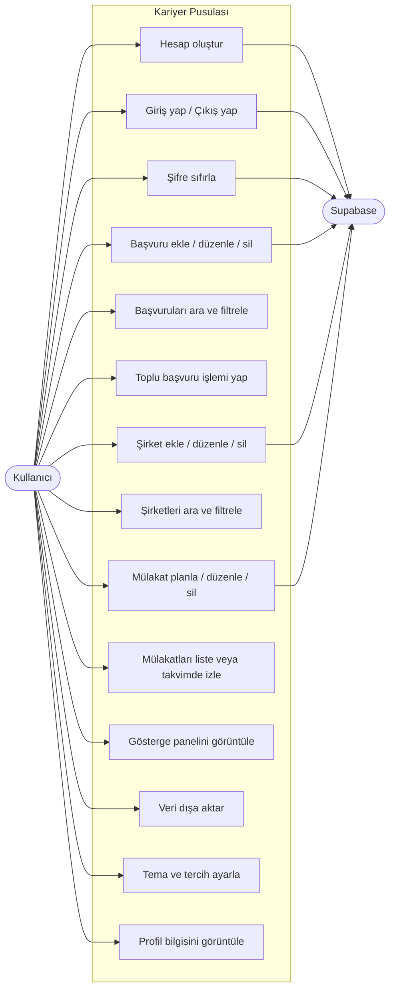
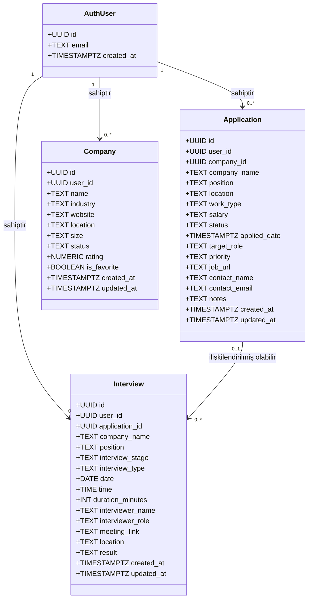
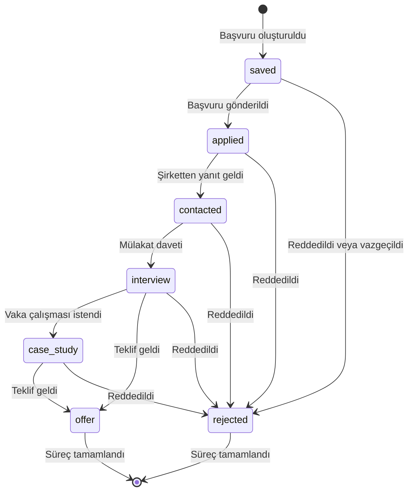
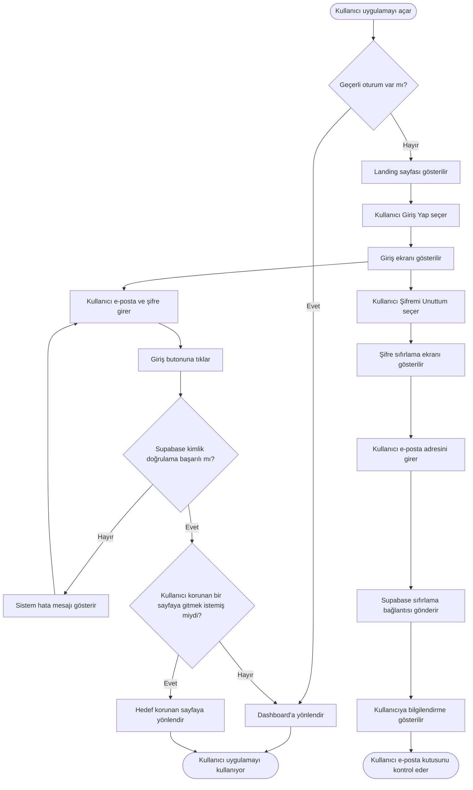

# BA-10 — BPMN ve UML Diyagramları

## Doküman Bilgileri

| Alan | Bilgi |
| --- | --- |
| Proje | Kariyer Pusulası |
| Doküman adı | BPMN ve UML Diyagramları |
| Doküman kodu | BA-10 |
| Sürüm | 0.1 |
| Durum | Taslak |
| Yazar | Serdar Ç. |
| Tarih | 1 Ağustos 2026 |
| İlişkili dokümanlar | BA-4 AS-IS/TO-BE Süreç Analizi, BA-6 Fonksiyonel Gereksinimler, BA-8 Kullanım Senaryoları |

Bu dokümandaki diyagramlar; uygulama rotaları, sayfa bileşenleri, form akışları, Supabase şeması ve form doğrulama kuralları incelenerek hazırlanmıştır. Diyagramlar mevcut uygulamadaki gerçek akışları gösterir; kodda bulunmayan adımlar eklenmemiştir.

## Amaç

Kariyer Pusulası'ndaki temel kullanıcı süreçlerini görsel modelleme teknikleriyle anlatmaktır. BPMN diyagramları iş sürecinin akışını; UML diyagramları ise sistemin yapısal ve davranışsal özelliklerini gösterir. Her iki teknik de İş Analizi alanında yaygın olarak kullanılır.

## Kapsam

Bu dokümanda aşağıdaki diyagramlar yer almaktadır:

- **BPMN:** Yeni başvuru ekleme süreci, mülakat planlama süreci
- **UML Kullanım Senaryosu (Use Case):** Sistemin aktörlerini ve ana işlevlerini özetleyen genel görünüm
- **UML Sınıf Diyagramı (Class Diagram):** Veritabanı tabloları arasındaki ilişkiler
- **UML Durum Diyagramı (State Diagram):** Başvuru kaydının alabileceği durumlar ve geçişler
- **UML Aktivite Diyagramı (Activity Diagram):** Oturum açma akışı

AI Kariyer Asistanı ve Şablonlar modülleri aktif olmadığından kapsam dışıdır.

## İçindekiler

1. BPMN hakkında
2. BPMN — Yeni başvuru ekleme süreci
3. BPMN — Mülakat planlama süreci
4. UML Kullanım Senaryosu Diyagramı
5. UML Sınıf Diyagramı
6. UML Durum Diyagramı — Başvuru durumları
7. UML Aktivite Diyagramı — Oturum açma akışı
8. Diyagram tasarım notları
9. Öğrenme notları
10. Mülakat soruları

---

## 1. BPMN Hakkında

BPMN (Business Process Model and Notation), iş süreçlerini standart simgelerle görselleştirmek için kullanılan bir gösterim biçimidir. Teknik bilgisi olmayan paydaşların da anlayabileceği biçimde tasarlanmıştır.

Bu dokümanda kullanılan temel BPMN öğeleri:

| Simge | Anlamı |
| --- | --- |
| Yuvarlak (Başlangıç olayı) | Sürecin başladığı nokta |
| Yuvarlak, çift çizgi (Bitiş olayı) | Sürecin tamamlandığı nokta |
| Dikdörtgen (Görev) | Kullanıcı veya sistem tarafından gerçekleştirilen adım |
| Baklava (Karar noktası) | Evet/Hayır dallanması |
| Havuz / Şerit (Pool/Lane) | Sürece katılan tarafları ayırır |

Bu dokümanın diyagramları Mermaid sözdizimi ile yazılmıştır. BPMN öğelerinin birebir karşılığı olmadığı durumlarda en yakın Flowchart gösterimi kullanılmıştır.

---

## 2. BPMN — Yeni Başvuru Ekleme Süreci

**Açıklama:** Kullanıcı, başvurular ekranından yeni bir iş başvurusu kaydı oluşturur. Sistem zorunlu alanları doğrular, kaydı veritabanına yazar ve listeye geri döner.

**İlişkili gereksinimler:** FR-08, FR-09, FR-10  
**İlişkili kabul kriterleri:** AC-07, AC-08, AC-09, AC-10

**Sürecin tarafları:**
- **Kullanıcı:** Formu dolduran ve kaydeden kişi
- **Sistem (Kariyer Pusulası):** Formu gösteren, doğrulama yapan ve Supabase'e yazan katman

---

## 3. BPMN — Mülakat Planlama Süreci

**Açıklama:** Kullanıcı, mülakatlar ekranından yeni bir mülakat kaydı oluşturur. İsteğe bağlı olarak mülakatı mevcut bir başvuruyla ilişkilendirir. Sistem zorunlu alanları doğrular ve kaydı oluşturur.

**İlişkili gereksinimler:** FR-26, FR-27, FR-28, FR-29  
**İlişkili kabul kriterleri:** AC-25, AC-26, AC-27, AC-28

---

## 4. UML Kullanım Senaryosu Diyagramı

**Açıklama:** Sistemin dışından gözlemlendiğinde hangi aktörün hangi işlevi kullanabildiğini özetler. Bu diyagram BA-8'deki kullanım senaryolarını görsel olarak destekler.

**Aktörler:**
- **İş arayan kullanıcı:** Uygulamanın tek kullanıcı tipidir.
- **Supabase:** Kimlik doğrulama ve veri depolamayı sağlayan harici servis.

---

## 5. UML Sınıf Diyagramı

**Açıklama:** Veritabanındaki üç ana tablo ile kimlik doğrulama kullanıcısı arasındaki ilişkileri gösterir. Alanlar `schema.sql` dosyasından alınmıştır.

**Notlar:**
- `company_id` alanı `Application` tablosunda opsiyoneldir; bir başvuru her zaman ayrı bir şirket kaydına bağlı olmak zorunda değildir.
- `application_id` alanı `Interview` tablosunda opsiyoneldir (`ON DELETE SET NULL`); bir başvuru silinse bile bağlı mülakat kaydı korunur.
- Tüm tablolarda Row Level Security politikası aktiftir; her kullanıcı yalnızca kendi `user_id` değeriyle eşleşen kayıtlara erişebilir.

---

## 6. UML Durum Diyagramı — Başvuru Durumları

**Açıklama:** Bir başvuru kaydının uygulama boyunca alabileceği durumları ve bu durumlar arasındaki olası geçişleri gösterir. Durumlar `schema.sql` dosyasındaki `CHECK` kısıtından alınmıştır.

**Geçerli durumlar:** `saved` · `applied` · `contacted` · `interview` · `case_study` · `offer` · `rejected`

**Not:** Kullanıcı herhangi bir durumu doğrudan başka bir duruma güncelleyebilir. Diyagram, sürecin mantıksal akışını gösterir; uygulama durum geçişlerini kısıtlamaz.

---

## 7. UML Aktivite Diyagramı — Oturum Açma Akışı

**Açıklama:** Kullanıcının uygulamaya giriş yapma ve korunan sayfalara yönlendirilme akışını gösterir. `App.tsx` içindeki `ProtectedRoute` ve `PublicRoute` bileşenleri bu akışın temelini oluşturur.

**İlişkili gereksinimler:** FR-02, FR-03, FR-04  
**İlişkili kabul kriterleri:** AC-03, AC-04, AC-05

---

## 8. Diyagram Tasarım Notları

Bu diyagramlar aşağıdaki ilkeler gözetilerek hazırlanmıştır:

- Her diyagram yalnızca kodda karşılığı olan bir akışı gösterir.
- Doğrulama adımları, yalnızca formda gerçekten uygulanan kuralları içerir.
- BPMN diyagramlarında "Supabase'e gönder" adımı, repository katmanındaki gerçek Supabase çağrısına karşılık gelir.
- Kullanıcının herhangi bir adımda formu kapatabildiği varsayılmıştır; bu durum diyagramları gereksiz uzatmamak için ayrıca modellenmemiştir.
- Mermaid sözdizimi kullanıldığından tam BPMN gösterimi (havuz, şerit, mesaj akışı vb.) uygulanamamıştır. Bu sınırlılık doküman notlarına eklenmiştir.

---

## Öğrenme Notları

### Bu doküman nedir?

BPMN ve UML diyagramları, iş süreçlerini ve sistem yapılarını görsel olarak anlatmak için kullanılan standart modelleme araçlarıdır. Metin tabanlı gereksinim dokümanlarına görsel bir katman ekler.

### Neden hazırlanır?

Karmaşık akışları düz metin yerine görsellerle anlatmak, paydaşların süreci daha hızlı anlamasını sağlar. Özellikle geliştirici, test yapan kişi ve proje sahibi arasındaki yorum farklarını azaltır.

### Kim hazırlar?

Genellikle iş analisti hazırlar. Teknik tasarım diyagramları geliştirici tarafından hazırlanabilir. Bu projede Serdar Ç. hem proje sahibi hem de Junior Business Analyst adayı olarak mevcut uygulamayı inceleyerek hazırlamaktadır.

### Kimler kullanır?

İş analisti, yazılım geliştirici, test yapan kişi, tasarımcı ve proje sahibi kullanır. Paydaş sunumlarında ve eğitim materyallerinde de başvurulabilir.

### Projenin hangi aşamasında hazırlanır?

BPMN genellikle gereksinim analizi aşamasında, süreçleri anlamak ve paylaşmak amacıyla hazırlanır. UML diyagramları gereksinim analizi ve tasarım aşamalarında birlikte kullanılabilir. Bu doküman mevcut bir uygulamadan geriye dönük hazırlanmıştır.

### Gerçek projelerde nasıl kullanılır?

BPMN diyagramları paydaş toplantılarında süreci doğrulamak için kullanılır. UML sınıf diyagramları veri modelini tartışmak için geliştiricilerle birlikte gözden geçirilir. Durum diyagramları hangi geçişlerin geçerli olduğunu netleştirir ve test senaryolarına kaynaklık eder.

### Junior İş Analisti için dikkat edilmesi gerekenler

- Diyagramı her detayı göstermek için değil, iletişimi kolaylaştırmak için hazırla.
- Diyagramdaki her adımın gerçek bir sistem davranışına veya kullanıcı eylemine karşılık geldiğinden emin ol.
- Kullandığın araçların BPMN veya UML'i tam destekleyip desteklemediğini not et; sınırlılıkları belgele.
- Diyagram ile metin dokümantasyonun çelişmediğinden emin ol.

### En sık yapılan hatalar

- Diyagramda kodda olmayan adımları veya kararları göstermek
- Diyagramı çok kalabalık tutarak okunmasını zorlaştırmak
- BPMN ile akış diyagramını farkını açıklamadan birbirinin yerine kullanmak
- Her küçük detayı modellemek yerine ana akışa odaklanmamak
- Diyagramı hazırladıktan sonra metin dokümanlarıyla tutarlılığını kontrol etmemek

---

## Mülakat Soruları

1. BPMN ile akış diyagramı (flowchart) arasındaki fark nedir?
2. Bu projede BPMN yerine başka bir modelleme tekniği kullanılabilir miydi?
3. UML'in kaç farklı diyagram türü vardır? Hepsini kullanmak gerekli midir?
4. Sınıf diyagramı ile varlık-ilişki diyagramı (ER diagram) arasındaki fark nedir?
5. Başvuru durum diyagramında neden doğrusal bir akış yerine farklı geçiş yolları gösterdiniz?
6. Kullanım senaryosu diyagramında Supabase'i neden harici aktör olarak gösterdiniz?
7. Mülakat planlama BPMN diyagramında karar noktaları neden bu şekilde yerleştirildi?
8. Bu diyagramlar gerçek bir projede ne zaman güncellenmeli?
9. Mermaid yerine profesyonel bir BPMN aracı kullansaydınız ne değişirdi?
10. Bir paydaş UML bilmiyorsa bu diyagramı nasıl açıklarsınız?

---

## Kalite Kontrolü

- [x] Tüm diyagramlar App.tsx, schema.sql, form bileşenleri ve doğrulama kurallarıyla karşılaştırıldı.
- [x] Aktif olmayan AI Asistanı ve Şablonlar modülleri diyagramlara eklenmedi.
- [x] Gerçek olmayan akış adımları veya kararlar eklenmedi.
- [x] Mermaid sözdizimi sınırlılığı belgede açıkça belirtildi.
- [x] Diyagramlar metin gereksinim dokümanlarıyla (BA-6, BA-8, BA-9) tutarlı tutuldu.
