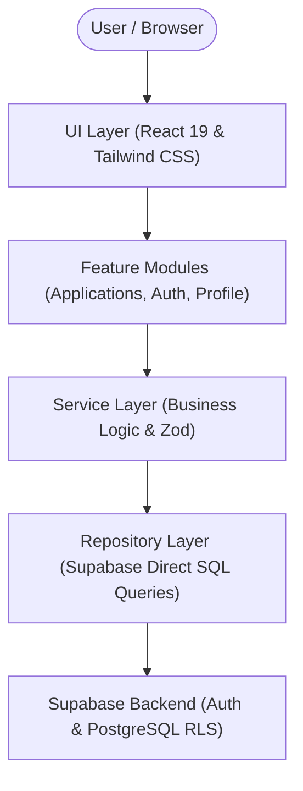
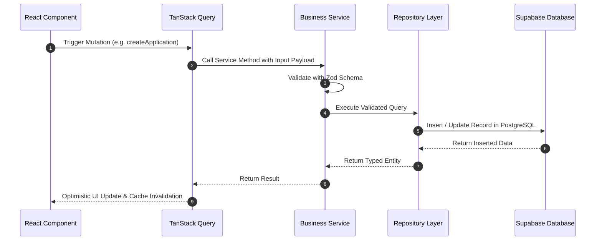

# 🏗️ Technical Architecture & Design System

## Overview

**Kariyer Pusulası** is structured following modern frontend architectural patterns designed for scale, maintainability, and high-speed user experience. The system follows a layered, feature-oriented architecture decoupling presentation, domain logic, data access, and backend persistence.

---

## 🏛️ Layered Architecture

### 1. Presentation Layer (`src/components/`, `src/pages/`, `src/layouts/`)
- **React Components**: Pure functional components utilizing custom design tokens and Tailwind CSS.
- **Glassmorphic Design Primitives**: Reusable atomic elements (`Button`, `Input`, `Modal`, `StatusBadge`, `Table`).
- **Route Protection**: Protected route guards redirecting unauthenticated users to auth flows.

### 2. State & Cache Management Layer (`src/hooks/`)
- **TanStack Query (React Query)**: Manages asynchronous server state caching, background refetching, and optimistic UI mutations.
- **Debounced Input Hooks**: Optimized real-time search without unnecessary API overhead.

### 3. Business & Domain Layer (`src/services/`)
- **Validation**: Strict schema validation using **Zod** for all form inputs and API payloads.
- **Domain Rules**: Custom error handling and transformation rules between UI forms and database schemas.

### 4. Data Access Layer (`src/repositories/`)
- **Repository Pattern**: Abstracts raw Supabase queries away from React hooks and components.
- **Type Safety**: Automatic type definitions mapping PostgreSQL schemas to TypeScript interfaces.

### 5. Backend & Security (`supabase/`)
- **Supabase Auth**: JWT-based session management and password encryption.
- **Row Level Security (RLS)**: Enforces candidate data isolation directly at the database engine level.

---

## ⚡ Data Flow

