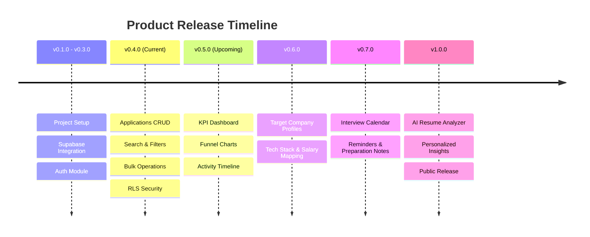

# 🗺️ Product Roadmap & Release Plan

This document outlines the product vision, milestone phases, and feature progression for **Kariyer Pusulası**.

---

## 🚩 Milestone Overview

---

## 📌 Phase Breakdown

### ✅ Phase 1 — Foundation (`v0.1.0` – `v0.3.0`)
- [x] React 19 + TypeScript + Vite project setup
- [x] Tailwind CSS glassmorphic design token system
- [x] Supabase backend architecture & PostgreSQL schema
- [x] Supabase Authentication (Login, Register, Password Reset, Protected Routes)
- [x] User Profile management

### ✅ Phase 2 — Applications Module (`v0.4.0` - Current)
- [x] Full Application CRUD (Create, Read, Update, Delete)
- [x] Real-time debounced search & multi-criteria filtering
- [x] Application detail modal & pipeline status transition
- [x] Bulk operations (multi-select status updates & deletes)
- [x] Responsive layout (Desktop Table & Mobile Touch Cards)
- [x] Production hardening & Zod schema validation

### 🚧 Phase 3 — Dashboard & Analytics (`v0.5.0` - In Progress)
- [ ] High-level KPI summary cards (Total Applied, Interviewing, Offer Rate, Rejections)
- [ ] Application conversion funnel chart
- [ ] Weekly/Monthly activity timeline
- [ ] Response rate analytics

### 🔜 Phase 4 — Productivity Suite (`v0.6.0` – `v0.7.0`)
- [ ] **Companies Module**: Target company profiles, notes, tech stack benchmarking
- [ ] **Interview Calendar**: Scheduled interview events, reminders, and preparation checklists
- [ ] **Document Manager**: Resume variants, cover letter templates, and portfolio attachments

### 🤖 Phase 5 — AI Intelligence (`v0.8.0` – `v1.0.0`)
- [ ] AI Resume vs Job Description Match Score
- [ ] Automated Cover Letter Generator
- [ ] Personalized Interview Q&A suggestions
- [ ] Public v1.0.0 Launch
